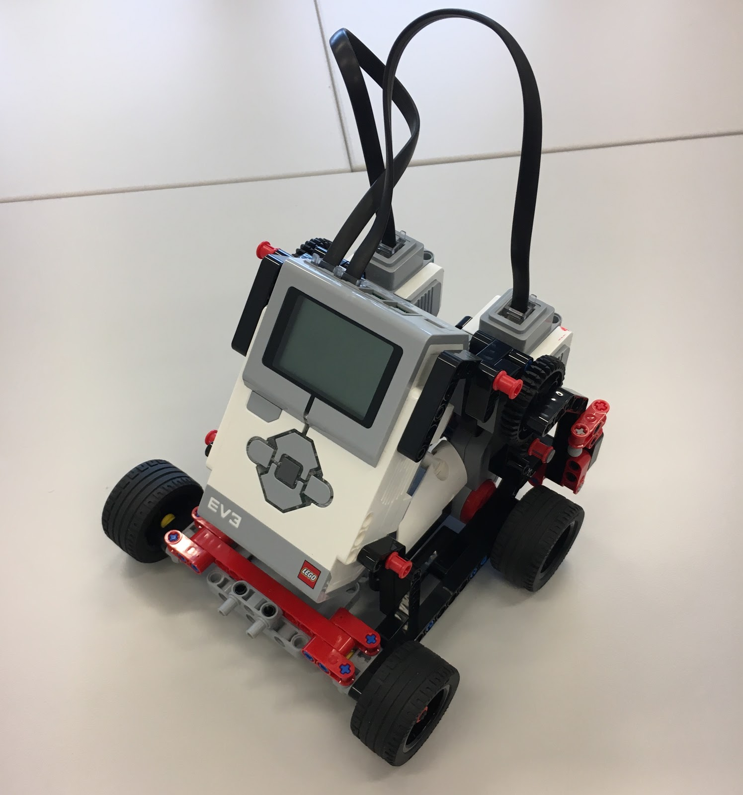
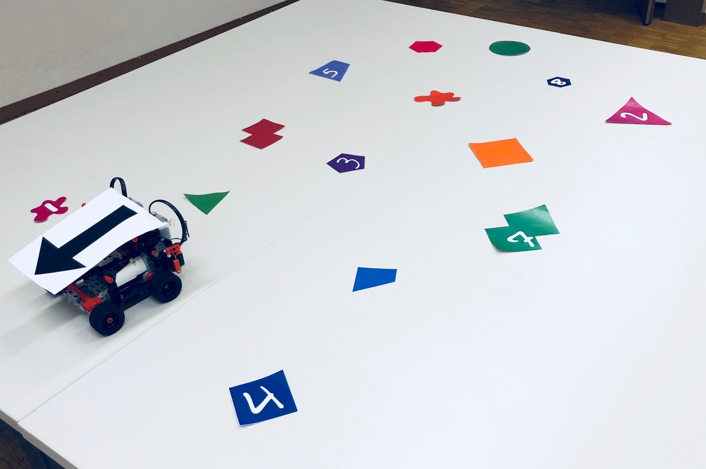

# Special project description

## Introduction
In this special project, your task is to use your image analysis skills to
control a [LEGO&copy; MINDSTORMS EV3][mindstorms] robot
(see figure below) in a specific environment.
The environment is a flat arena of approximately 3 meters by 3 meters
containing visual elements such as different geometric shapes and handwritten
digits with different colors (see figure below).
The exact disposition of these elements may vary.
The robot uses the live view of the environment by a camera mounted above
the arena and pointed directly at the arena, such that the plane of the arena
is parallel to the image plane of the camera.

Different tasks to be implemented are defined in the following section,
each of them allowing you to collect a given number of points.
During the last session on Friday, June 1, each team will run its code
on the robot and try to collect as many points as possible.
You will also present your approach to the problem and explain briefly
how you implemented your solution.

[mindstorms]: https://www.lego.com/en-us/mindstorms/products/mindstorms-ev3-31313

## Task: Solve the puzzle
Your main task is to control the robot and make it solve the puzzle!
The detailed scenario is defined as follows:
* Several shapes with different colors and sizes are placed on the arena.
Some of them have a handwritten digit (zero to eight) printed on them,
we call them “Pieces”.
The “Holes” are the ones without anything printed on them.
* The robot should fit all “pieces” to their corresponding “holes”,
one by one, in the right order.
* The order of “pieces” are defined by their labels:
the piece with the smallest value on top of it should be taken care of at first,
the one with the second smallest digit should be next, and so on to the last piece.
* The robot starts from a random position.
A black arrow on the top side of the robot will allow you to localize it
and detect its orientation.
Please note that this arrow is the only black object in the arena.
* Once all pieces are successfully fit, the robot has to go back to the home plate.
The home plate is the only circle in the arena.
* Each piece successfully fit to its right hole by the robot brings 3 points
and each mistake costs you 1 point.

### Notes
1. We call a “hole” a fit for a “piece” when they have similar shapes.
Please note **that they can have different sizes, colors and orientations!**

1. All digits are oriented vertically regarding frames orientation.

1. The pieces and holes are virtual and printed on the table.
They will not be physically picked up and dropped off by the robot.
By going on top of a shape and “beeping” once, we consider it as “taken”.
By “beeping” twice we consider it as “released”.

### Bonus
There is 6 extra points if the robot could still respect the right order
even in case where digits are not oriented vertically.

## Organization

### Sessions
Three sessions are dedicated to the special project, organized similarly to
exercise sessions.
During the last session on June 1,  you will present your work and test your
implementation in the arena (see table below).

| Date          | Type         | Room |
| ------------- | ------------ | ---- |
| May 11        | Session 1    | BC01 |
| May 18        | Session 2    | BC01 |
| May 25        | Session 3    | BC01 |
| June 1        | Presentation | BC01 |

To test your codes on a real case scenario with a robot, we have prepared
two arenas in room ELE115.
The room will be available each day from 8AM to 6PM through May 31.
To facilitate the organization, we will provide you with a doodle to book
different time slots for your team.

### Teams
You will work in teams of three.
You will need to register these teams on the course Moodle before the second
session dedicated to this special project (on Friday, May 18).

### Tools
The complete implementation of this special project will be done in Python.
The robot will be controlled using the hardware support package through
a bluetooth connexion and we will provide you with an API to ease its control.
The images are provided by a surveillance camera, transferring images
via a USB connection. These are easily grabbed form Python using openCV
library and the url of the stream.

### Data
In order to get started, we provide a sequence of images taken in conditions
similar to the conditions in which you will run your algorithm:
[data/project-data.tar.gz][project-data] contains images of a smaller arena
containing shapes and digits and showing the robot following the path that
it is supposed to follow.
The final arena might be up to two times bigger but the distance of the camera
should not vary too much and the resolution of the image is not expected
to change drastically.
These frames also contain images of different elements
(namely different kinds of geometrical shapes and other related objects).
You are free to crop and use them to train classifiers, if needed.

For digits classification, you are free to use the MNIST dataset that you have
seen in [Lab 3][l03].

You are free to acquire more images by yourself if you think that it is necessary.
This can be done during the scheduled sessions.

[project-data]: ../data/project-data.tar.gz
[l03]: ../labs/lab_03_classification.ipynb

### Deliverables
During the last session, Friday, June 1, each team will also present
their approach in 10 minutes.
You should focus on your solution and provide a clear overview of the choices
you made and the steps you implemented.
No report is needed.

You will also run your code on the robot and try to collect as many points
as possible.
You will get 10 minutes for the demo in total (this includes set-up).

You should provide an archive containing all the python files
+ list of packages used in your code by May 31, 11:59 PM.
Name the main file with the name of your team (e.g. TeamA.py) so that
we can run that file in order to execute your code.
